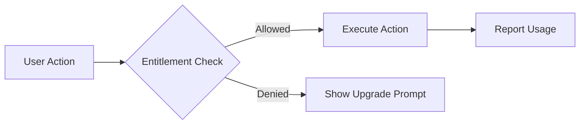

Entitlements determine **what features a customer can access** based on their active plan, purchased add-ons, and subscription status. The Entitlement Engine evaluates these rules in real-time to gate access to your application.

## How Entitlements Work

Every feature check follows this flow:



1. **Check entitlement** before performing the action
2. **Execute** the action if allowed
3. **Report usage** for metered features (see [Usage Metering](/concepts/usage-metering))

<Warning>
  Always check entitlements **before** consuming resources. Checking after the fact can lead to abuse and revenue loss.
</Warning>

## Checking Entitlements

### Server-Side (Recommended)

Use the Node.js SDK for authoritative checks:

```typescript
import { Revstack } from "@revstackhq/node";

const revstack = new Revstack({ secretKey: process.env.REVSTACK_SECRET_KEY });

// Check a boolean feature
const ssoCheck = await revstack.entitlements.check(
  "usr_abc123", // customerId
  "sso", // featureId
);

if (!ssoCheck.allowed) {
  throw new Error("SSO is not available on your plan");
}

// Check a static feature with current usage
const seatsCheck = await revstack.entitlements.check(
  "usr_abc123",
  "seats",
  { amount: 1 }, // requesting 1 seat
);

if (!seatsCheck.allowed) {
  return res.status(403).json({
    error: "Seat limit reached",
    reason: seatsCheck.reason, // 'limit_reached'
    upgrade_url: "/billing/upgrade",
  });
}

// Check a metered feature before consuming
const tokensCheck = await revstack.entitlements.check(
  "usr_abc123",
  "ai_tokens",
  { amount: 5000 }, // requesting 5K tokens
);

if (tokensCheck.allowed) {
  // Perform the AI operation
  const response = await openai.chat.completions.create({ /* ... */ });

  // Report actual usage
  await revstack.usage.report({
    customerId: "usr_abc123",
    featureId: "ai_tokens",
    amount: response.usage.total_tokens,
  });
}
```

### Client-Side (Non-Authoritative)

Use the React SDK for UI gating:

```tsx
import { useEntitlements, UpgradePrompt } from "@revstackhq/react";

function SettingsPage() {
  const { check, loading } = useEntitlements();
  const ssoEnabled = check("sso");

  if (loading) return <Skeleton />;

  return (
    <div>
      {ssoEnabled.allowed ? (
        <SSOConfigPanel />
      ) : (
        <UpgradePrompt feature="sso" />
      )}
    </div>
  );
}
```

<Info>
  **Best Practice**: Always re-check entitlements on the server even if the client UI hides features. Client-side checks are for UX only.
</Info>

## The CheckResult Object

Every entitlement check returns a `CheckResult` with the following structure:

```typescript
interface CheckResult {
  allowed: boolean; // Can the action proceed?
  reason?: "feature_missing" | "limit_reached" | "past_due" | "included" | "overage_allowed";
  remaining?: number; // Units left before hitting limit (Infinity if unlimited)
  cost_estimate?: number; // Estimated overage cost in cents
  granted_by?: string[]; // Which plan/addon slugs granted access
}
```

### Example Responses

<CodeGroup>
```json Feature missing from plan
{
  "allowed": false,
  "reason": "feature_missing"
}
```

```json Within included limit
{
  "allowed": true,
  "reason": "included",
  "remaining": 2,
  "granted_by": ["pro"]
}
```

```json Hard limit reached
{
  "allowed": false,
  "reason": "limit_reached",
  "remaining": 0,
  "granted_by": ["pro"]
}
```

```json Soft limit - overage allowed
{
  "allowed": true,
  "reason": "overage_allowed",
  "remaining": 0,
  "cost_estimate": 75,
  "granted_by": ["pro"]
}
```

```json Subscription past due
{
  "allowed": false,
  "reason": "past_due",
  "remaining": 0
}
```
</CodeGroup>

## The Entitlement Engine

Under the hood, Revstack uses the `EntitlementEngine` class to evaluate access. You can use this directly for offline checks:

```typescript
import { EntitlementEngine } from "@revstackhq/core";
import type { PlanDef, AddonDef } from "@revstackhq/core";

// Define a plan
const proPlan: PlanDef = {
  slug: "pro",
  name: "Pro",
  is_default: false,
  is_public: true,
  type: "paid",
  status: "active",
  prices: [{ amount: 2900, currency: "USD", billing_interval: "monthly" }],
  features: {
    seats: { value_limit: 5, is_hard_limit: true },
    sso: { value_bool: false },
  },
};

// Define an add-on
const ssoAddon: AddonDef = {
  slug: "sso_module",
  name: "SSO Module",
  type: "recurring",
  amount: 10000,
  currency: "USD",
  billing_interval: "monthly",
  features: {
    sso: { has_access: true },
  },
};

// Create engine instance
const engine = new EntitlementEngine(
  proPlan,
  [ssoAddon], // active addons
  "active", // subscription status
);

// Check entitlements
const ssoResult = engine.check("sso");
console.log(ssoResult);
// { allowed: true, remaining: Infinity, granted_by: ['sso_module'] }

const seatsResult = engine.check("seats", 3);
console.log(seatsResult);
// { allowed: true, reason: 'included', remaining: 2, granted_by: ['pro'] }
```

### Engine Behavior

The engine follows these rules when aggregating entitlements:

<Steps>
  <Step title="Check subscription status">
    If the subscription is `past_due` or `canceled`, all checks return `{ allowed: false, reason: "past_due" }`.
  </Step>
  
  <Step title="Aggregate limits from plan and add-ons">
    - Add-ons with `type: "increment"` **add** to the base plan limit
    - Add-ons with `type: "set"` **override** the base plan limit completely
    - Add-ons are processed deterministically: `"set"` overrides before `"increment"` additions
  </Step>
  
  <Step title="Evaluate hard vs soft limits">
    - If **any** source (plan or add-on) sets `is_hard_limit: false`, the feature becomes soft-limited
    - Soft limits allow overage with `reason: "overage_allowed"`
    - Hard limits block access with `reason: "limit_reached"`
  </Step>
  
  <Step title="Return result">
    The `granted_by` array lists all plans/add-ons that contributed to the access decision.
  </Step>
</Steps>

## Feature Types in Detail

### Boolean Features

Simple on/off toggles (e.g., SSO, Custom Domain, Priority Support).

```typescript
// In plan config
features: {
  sso: { value_bool: true }, // Enabled
  custom_domain: { value_bool: false }, // Disabled
}

// Check at runtime
const result = engine.check("sso");
// { allowed: true, remaining: Infinity }
```

<Note>
  For boolean features, `remaining` is always `Infinity` when allowed.
</Note>

### Static Features

Fixed limits included in the plan (e.g., Seats, Projects, Workspaces).

```typescript
// In plan config
features: {
  seats: {
    value_limit: 5,
    is_hard_limit: true, // Block when limit reached
  },
}

// Check with current usage
const result = engine.check("seats", 3); // 3 seats in use
// { allowed: true, reason: 'included', remaining: 2 }
```

### Metered Features

Usage-based features that reset periodically (e.g., API Calls, AI Tokens, Storage).

```typescript
// In plan config
features: {
  ai_tokens: {
    value_limit: 100000,
    is_hard_limit: false, // Allow overage
    reset_period: "monthly",
  },
}

// Check with requested amount
const result = engine.check("ai_tokens", 95000); // 95K already used
// { allowed: true, reason: 'overage_allowed', remaining: 0 }
```

<Info>
  See [Usage Metering](/concepts/usage-metering) for tracking consumption of metered features.
</Info>

## Hard vs Soft Limits

<Tabs>
  <Tab title="Hard Limit">
    **Blocks access** when the limit is reached. Best for finite resources.

    ```typescript
    features: {
      seats: { value_limit: 5, is_hard_limit: true },
    }
    ```

    **Use cases**: Team seats, concurrent jobs, storage quotas
  </Tab>
  
  <Tab title="Soft Limit">
    **Allows overage** with additional charges. Best for consumption-based features.

    ```typescript
    features: {
      api_calls: { value_limit: 10000, is_hard_limit: false },
    }
    ```

    **Use cases**: API calls, AI tokens, bandwidth

    <Warning>
      Soft limits require overage pricing in your plan's `prices[].overage_configuration`.
    </Warning>
  </Tab>
</Tabs>

## Batch Checking

Check multiple features in a single operation:

```typescript
const results = engine.checkBatch({
  seats: 3,
  api_calls: 5000,
  ai_tokens: 10000,
});

console.log(results);
// {
//   seats: { allowed: true, remaining: 2, ... },
//   api_calls: { allowed: true, remaining: 5000, ... },
//   ai_tokens: { allowed: false, reason: 'limit_reached', ... },
// }
```

## Common Patterns

### Optimistic Entitlement Checks

For low-latency requirements, check entitlements **before** making external API calls:

```typescript
// 1. Check entitlement (fast)
const check = await revstack.entitlements.check(userId, "ai_tokens", { amount: 5000 });
if (!check.allowed) throw new Error("Token limit exceeded");

// 2. Report usage immediately (non-blocking)
await revstack.usage.report({ customerId: userId, featureId: "ai_tokens", amount: 5000 });

// 3. Call external API (slow)
try {
  const result = await openai.chat.completions.create({ /* ... */ });
} catch (error) {
  // 4. Revert usage if operation fails
  await revstack.usage.revert({
    customerId: userId,
    featureId: "ai_tokens",
    amount: 5000,
    reason: "operation_failed",
  });
  throw error;
}
```

### Showing Remaining Usage

Display limits to users:

```tsx
import { useEntitlements } from "@revstackhq/react";

function UsageBar() {
  const { check } = useEntitlements();
  const result = check("api_calls");

  if (!result) return null;

  const used = result.remaining === Infinity ? 0 : 10000 - result.remaining;
  const total = result.remaining === Infinity ? "Unlimited" : 10000;

  return (
    <div>
      <ProgressBar value={used} max={total} />
      <p>{used} / {total} API calls this month</p>
    </div>
  );
}
```

### Graceful Degradation

Handle missing features gracefully:

```typescript
const prioritySupportCheck = await revstack.entitlements.check(userId, "priority_support");

if (prioritySupportCheck.allowed) {
  // Route to priority queue
  await supportQueue.add(ticket, { priority: "high" });
} else {
  // Route to standard queue
  await supportQueue.add(ticket, { priority: "normal" });
}
```

## Next Steps

<CardGroup cols={2}>
  <Card title="Usage Metering" icon="chart-line" href="/concepts/usage-metering">
    Track consumption for metered features
  </Card>
  <Card title="Subscriptions" icon="credit-card" href="/concepts/subscriptions">
    Manage customer subscriptions and billing
  </Card>
</CardGroup>
