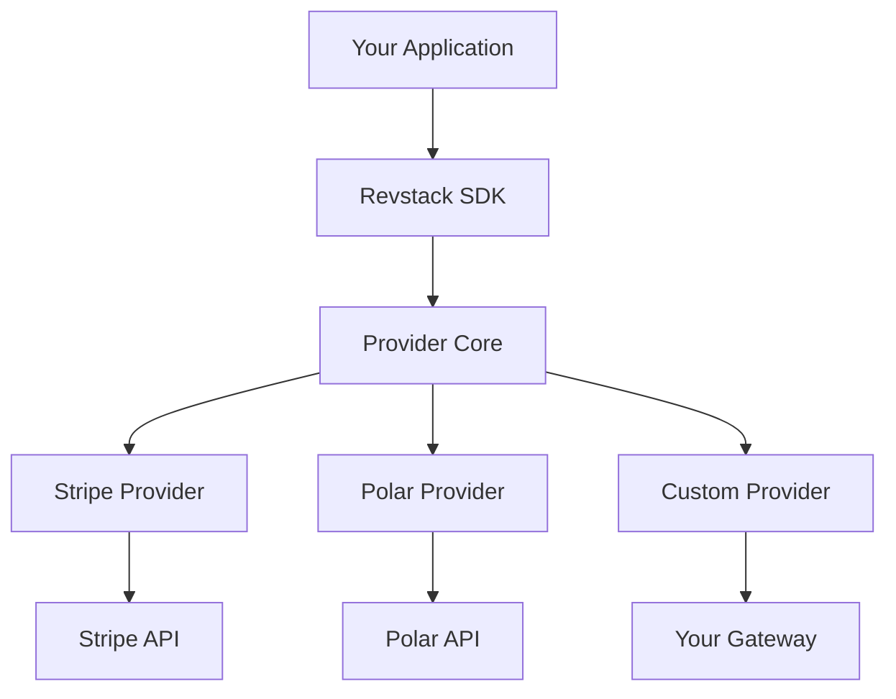

Revstack's provider system abstracts payment gateway complexity behind a unified API. Write your billing logic once, and switch between Stripe, Polar, or custom providers without changing application code.

## Why Provider Abstraction?

<CardGroup cols={2}>
  <Card title="Multi-Provider Support" icon="layer-group">
    Support multiple payment processors simultaneously for different markets
  </Card>
  <Card title="Vendor Independence" icon="unlock">
    Switch providers without rewriting your entire billing stack
  </Card>
  <Card title="Unified API" icon="code">
    One consistent API across all providers - no provider-specific quirks
  </Card>
  <Card title="Feature Parity" icon="check-double">
    Graceful degradation when providers don't support specific features
  </Card>
</CardGroup>

## Provider Architecture

Revstack uses a plugin-based provider system:



All providers implement the same `IProvider` interface, ensuring consistent behavior.

## Available Providers

### Official Providers

Revstack maintains these production-ready providers:

<Tabs>
  <Tab title="Stripe">
    **Stripe** - The most popular payment processor for SaaS.

    ```typescript
    import { StripeProvider } from "@revstackhq/provider-stripe";

    const provider = new StripeProvider({
      apiKey: process.env.STRIPE_SECRET_KEY,
      webhookSecret: process.env.STRIPE_WEBHOOK_SECRET,
    });
    ```

    **Capabilities**:
    - Checkout: `redirect` (Stripe Checkout) or `native_sdk` (Stripe Elements)
    - Subscriptions: Native billing engine with proration
    - Payments: Full support including refunds, partial refunds, auth/capture
    - Catalog: Inline pricing (no pre-creation needed)
    - Webhooks: HMAC signature verification
  </Tab>

  <Tab title="Polar">
    **Polar** - Developer-first billing for open-source projects.

    ```typescript
    import { PolarProvider } from "@revstackhq/provider-polar";

    const provider = new PolarProvider({
      apiKey: process.env.POLAR_SECRET_KEY,
      webhookSecret: process.env.POLAR_WEBHOOK_SECRET,
    });
    ```

    **Capabilities**:
    - Checkout: `redirect` (Polar Checkout)
    - Subscriptions: Native billing with GitHub Sponsors integration
    - Payments: One-time payments and subscriptions
    - Catalog: Pre-created products/prices required
    - Webhooks: Signature verification
  </Tab>
</Tabs>

### Community Providers

Build your own provider for:
- Regional payment gateways (Razorpay, Mercado Pago, etc.)
- Crypto payment processors (Coinbase Commerce, BTCPay)
- Custom billing systems

<Info>
  See the [Custom Providers](/providers/custom-providers) guide to build your own.
</Info>

## Provider Capabilities

Providers declare their capabilities via a `manifest` object:

```typescript
import type { ProviderCapabilities } from "@revstackhq/provider-core";

const capabilities: ProviderCapabilities = {
  checkout: {
    supported: true,
    strategy: "redirect", // or 'native_sdk' or 'sdui'
  },
  payments: {
    supported: true,
    features: {
      refunds: true,
      partialRefunds: true,
      capture: true,
      disputes: true,
    },
  },
  subscriptions: {
    supported: true,
    mode: "native", // Provider handles billing, or 'virtual' for Revstack-managed
    features: {
      pause: true,
      resume: true,
      cancellation: true,
      proration: true,
    },
  },
  customers: {
    supported: true,
    features: {
      create: true,
      update: true,
      delete: true,
    },
  },
  webhooks: {
    supported: true,
    verification: "signature", // HMAC signature
  },
  catalog: {
    supported: true,
    strategy: "inline", // or 'pre_created'
  },
};
```

### Checkout Strategies

<ParamField path="strategy" type="CheckoutStrategy">
  **`redirect`**: User is redirected to provider's hosted checkout page (e.g., Stripe Checkout)
  - Easiest integration, full PCI compliance
  - User leaves your domain

  **`native_sdk`**: Embed provider's payment form in your app (e.g., Stripe Elements)
  - User stays on your domain, seamless UX
  - Requires client-side SDK integration

  **`sdui`**: Server-Driven UI - provider returns JSON primitives, Revstack renders natively
  - Use case: Crypto payments, bank transfers (Pix, Boleto)
  - No external scripts required
</ParamField>

### Subscription Modes

<ParamField path="mode" type="SubscriptionMode">
  **`native`**: Provider acts as the billing engine
  - Provider handles recurring charges, retries, and proration
  - Revstack mirrors state via webhooks
  - Example: Stripe Billing, Polar Subscriptions

  **`virtual`**: Revstack acts as the billing engine
  - Revstack runs the scheduler and triggers one-time payments
  - Use case: Providers without native subscription support (e.g., simple gateways)
</ParamField>

## Configuring Providers

Providers are configured in your Revstack Cloud dashboard or via environment variables:

```bash .env
# Primary provider (e.g., Stripe)
REVSTACK_PROVIDER=stripe
STRIPE_SECRET_KEY=sk_test_...
STRIPE_WEBHOOK_SECRET=whsec_...

# Secondary provider (e.g., Polar for open-source tier)
POLAR_SECRET_KEY=polar_...
POLAR_WEBHOOK_SECRET=polar_whsec_...
```

Revstack automatically routes payments to the correct provider based on your configuration.

## Provider Selection

For multi-provider setups, specify which provider to use:

```typescript
import { Revstack } from "@revstackhq/node";

const revstack = new Revstack({ secretKey: process.env.REVSTACK_SECRET_KEY });

// Create subscription with specific provider
const subscription = await revstack.subscriptions.create({
  customerId: "usr_abc123",
  planId: "plan_pro",
  provider: "stripe", // Override default provider
});

// Create checkout session with provider selection
const session = await revstack.checkout.create({
  customerId: "usr_abc123",
  planId: "plan_oss",
  provider: "polar", // Use Polar for open-source tier
  successUrl: "https://myapp.com/success",
  cancelUrl: "https://myapp.com/pricing",
});
```

## Provider Interface

All providers implement the `IProvider` interface:

```typescript
import type {
  IProvider,
  ProviderContext,
  AsyncActionResult,
} from "@revstackhq/provider-core";

interface IProvider {
  // Required metadata
  readonly manifest: ProviderManifest;

  // Lifecycle
  onInstall(ctx: ProviderContext, input: InstallInput): Promise<AsyncActionResult<InstallResult>>;
  onUninstall(ctx: ProviderContext, input: UninstallInput): Promise<AsyncActionResult<boolean>>;

  // Webhooks (required)
  verifyWebhookSignature(ctx: ProviderContext, payload: string, headers: Record<string, string>, secret: string): Promise<AsyncActionResult<boolean>>;
  parseWebhookEvent(ctx: ProviderContext, payload: any): Promise<AsyncActionResult<RevstackEvent | null>>;

  // Checkout (optional)
  createCheckoutSession?(ctx: ProviderContext, input: CheckoutSessionInput): Promise<AsyncActionResult<CheckoutSessionResult>>;

  // Subscriptions (optional)
  createSubscription?(ctx: ProviderContext, input: CreateSubscriptionInput): Promise<AsyncActionResult<string>>;
  cancelSubscription?(ctx: ProviderContext, input: CancelSubscriptionInput): Promise<AsyncActionResult<string>>;
  pauseSubscription?(ctx: ProviderContext, input: PauseSubscriptionInput): Promise<AsyncActionResult<string>>;
  resumeSubscription?(ctx: ProviderContext, input: ResumeSubscriptionInput): Promise<AsyncActionResult<string>>;

  // Payments (optional)
  createPayment?(ctx: ProviderContext, input: CreatePaymentInput): Promise<AsyncActionResult<string>>;
  refundPayment?(ctx: ProviderContext, input: RefundPaymentInput): Promise<AsyncActionResult<string>>;
  capturePayment?(ctx: ProviderContext, input: CapturePaymentInput): Promise<AsyncActionResult<string>>;

  // Customers (optional)
  createCustomer?(ctx: ProviderContext, input: CreateCustomerInput): Promise<AsyncActionResult<string>>;
  updateCustomer?(ctx: ProviderContext, input: UpdateCustomerInput): Promise<AsyncActionResult<string>>;
  deleteCustomer?(ctx: ProviderContext, input: DeleteCustomerInput): Promise<AsyncActionResult<boolean>>;

  // Catalog (optional)
  createProduct?(ctx: ProviderContext, input: ProductInput): Promise<AsyncActionResult<string>>;
  createPrice?(ctx: ProviderContext, input: PriceInput): Promise<AsyncActionResult<string>>;
}
```

### BaseProvider Class

Extend `BaseProvider` to inherit default implementations:

```typescript
import { BaseProvider } from "@revstackhq/provider-core";

export class MyCustomProvider extends BaseProvider {
  readonly manifest = {
    slug: "my-gateway",
    name: "My Payment Gateway",
    version: "1.0.0",
    capabilities: {
      checkout: { supported: true, strategy: "redirect" },
      subscriptions: { supported: false, mode: "virtual" },
      payments: { supported: true, features: { refunds: true } },
      // ...
    },
  };

  async onInstall(ctx, input) {
    // Setup provider credentials
    return { status: "success", data: { webhookUrl: ctx.webhookUrl } };
  }

  async onUninstall(ctx, input) {
    // Cleanup provider resources
    return { status: "success", data: true };
  }

  async verifyWebhookSignature(ctx, payload, headers, secret) {
    // Verify HMAC signature
    const signature = headers["x-gateway-signature"];
    const isValid = verifyHmac(payload, signature, secret);
    return { status: "success", data: isValid };
  }

  async parseWebhookEvent(ctx, payload) {
    // Map provider event to Revstack event
    if (payload.type === "charge.succeeded") {
      return {
        status: "success",
        data: {
          type: "payment.succeeded",
          data: { paymentId: payload.id, customerId: payload.customer },
        },
      };
    }
    return { status: "success", data: null };
  }

  async createCheckoutSession(ctx, input) {
    // Create hosted checkout page
    const session = await myGateway.checkout.create({
      amount: input.amount,
      currency: input.currency,
    });
    return { status: "success", data: { url: session.url, sessionId: session.id } };
  }
}
```

## Error Handling

Providers return `AsyncActionResult` for consistent error handling:

```typescript
type AsyncActionResult<T> =
  | { status: "success"; data: T }
  | { status: "failed"; error: { code: RevstackErrorCode; message: string } };
```

Revstack SDK automatically converts provider errors:

```typescript
try {
  const sub = await revstack.subscriptions.create({ /* ... */ });
} catch (error) {
  if (error.code === "provider_not_implemented") {
    console.error("This provider doesn't support subscriptions");
  } else if (error.code === "payment_failed") {
    console.error("Payment was declined");
  }
}
```

## Webhook Handling

Providers translate webhook events to Revstack's normalized event format:

```typescript
// Provider-specific webhook payload
const stripeEvent = {
  type: "customer.subscription.created",
  data: { object: { id: "sub_123", customer: "cus_abc" } },
};

// Provider maps it to Revstack event
const revstackEvent = {
  type: "subscription.created",
  data: { id: "sub_123", customerId: "cus_abc" },
};
```

Your application always receives normalized events, regardless of provider.

## Testing Providers

Revstack provides a smoke test runner for validating provider implementations:

```typescript
import { runProviderSmokeTests } from "@revstackhq/provider-core";
import { MyCustomProvider } from "./my-provider";

const provider = new MyCustomProvider();

await runProviderSmokeTests(provider, {
  credentials: {
    apiKey: process.env.GATEWAY_API_KEY,
  },
  testMode: true,
});
```

The test suite validates:
- Webhook signature verification
- Event parsing
- Checkout session creation
- Subscription lifecycle (if supported)
- Refund processing (if supported)

## Provider Comparison

<table>
  <thead>
    <tr>
      <th>Feature</th>
      <th>Stripe</th>
      <th>Polar</th>
      <th>Custom</th>
    </tr>
  </thead>
  <tbody>
    <tr>
      <td>Checkout Strategy</td>
      <td>Redirect + Native SDK</td>
      <td>Redirect</td>
      <td>Varies</td>
    </tr>
    <tr>
      <td>Subscription Mode</td>
      <td>Native</td>
      <td>Native</td>
      <td>Virtual (Revstack-managed)</td>
    </tr>
    <tr>
      <td>Proration</td>
      <td>✅ Automatic</td>
      <td>✅ Automatic</td>
      <td>❌ Manual</td>
    </tr>
    <tr>
      <td>Pause/Resume</td>
      <td>✅ Yes</td>
      <td>❌ No</td>
      <td>Depends</td>
    </tr>
    <tr>
      <td>Refunds</td>
      <td>✅ Full + Partial</td>
      <td>✅ Full only</td>
      <td>Depends</td>
    </tr>
    <tr>
      <td>Auth/Capture</td>
      <td>✅ Yes</td>
      <td>❌ No</td>
      <td>Depends</td>
    </tr>
    <tr>
      <td>Billing Portal</td>
      <td>✅ Yes</td>
      <td>✅ Yes</td>
      <td>❌ No</td>
    </tr>
  </tbody>
</table>

## Next Steps

<CardGroup cols={2}>
  <Card title="Custom Providers" icon="wrench" href="/providers/custom-providers">
    Build your own provider for regional gateways
  </Card>
  <Card title="Billing as Code" icon="code" href="/concepts/billing-as-code">
    Define your pricing model in TypeScript
  </Card>
</CardGroup>
