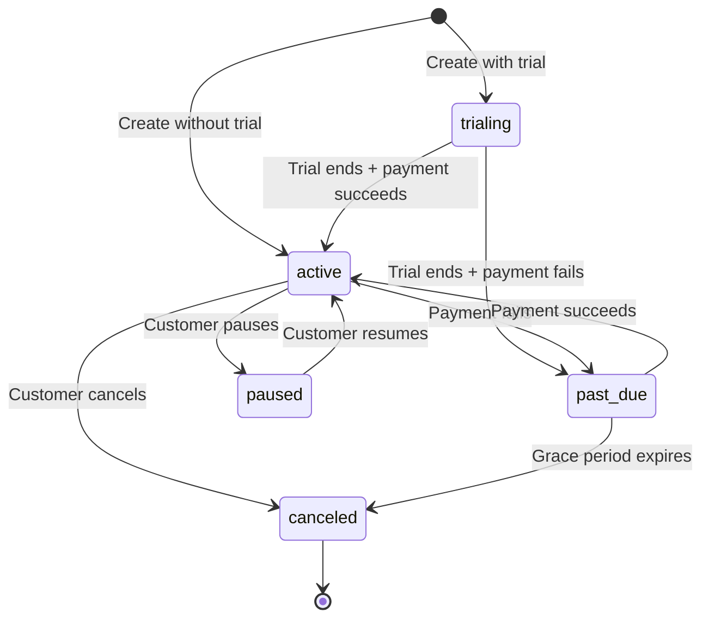

Subscriptions represent recurring billing relationships between your customers and your SaaS. Revstack handles the entire subscription lifecycle, from creation to cancellation, with automatic invoicing and proration.

## Subscription Lifecycle

A subscription progresses through these states:



### Subscription Statuses

<ResponseField name="active" type="status">
  Subscription is active and billing normally. Customer has full access to entitlements.
</ResponseField>

<ResponseField name="trialing" type="status">
  Customer is in free trial period. No payment required yet. Full access granted.
</ResponseField>

<ResponseField name="past_due" type="status">
  Payment failed. Customer loses access to all features until payment succeeds.
  
  <Warning>
    The Entitlement Engine blocks **all** feature checks when status is `past_due`.
  </Warning>
</ResponseField>

<ResponseField name="paused" type="status">
  Customer temporarily paused billing (if provider supports it). Access may be restricted.
</ResponseField>

<ResponseField name="canceled" type="status">
  Subscription was canceled. No further billing. Access revoked.
</ResponseField>

## Creating Subscriptions

Use the Subscriptions Client to create a new subscription:

```typescript
import { Revstack } from "@revstackhq/node";

const revstack = new Revstack({ secretKey: process.env.REVSTACK_SECRET_KEY });

// Create a subscription with a free trial
const subscription = await revstack.subscriptions.create({
  customerId: "usr_abc123",
  planId: "plan_pro",
  priceId: "price_monthly", // Optional: specify which price to use
});

console.log(subscription);
// {
//   id: 'sub_xyz789',
//   customerId: 'usr_abc123',
//   planId: 'plan_pro',
//   status: 'trialing',
//   currentPeriodStart: '2026-03-05T00:00:00Z',
//   currentPeriodEnd: '2026-03-19T00:00:00Z', // 14-day trial
//   trialEnd: '2026-03-19T00:00:00Z',
//   canceledAt: null,
// }
```

### Checkout Flow

For new subscriptions, use the hosted checkout:

```typescript
import { createCheckoutSession } from "@revstackhq/node";

// Create a checkout session
const session = await revstack.checkout.create({
  customerId: "usr_abc123",
  planId: "plan_pro",
  priceId: "price_yearly",
  successUrl: "https://myapp.com/success",
  cancelUrl: "https://myapp.com/pricing",
  addons: ["extra_seats"], // Optional: include add-ons
  coupon: "LAUNCH50", // Optional: apply discount
});

// Redirect user to checkout
res.redirect(session.url);
```

<Info>
  Revstack creates the subscription automatically when checkout completes. You'll receive a `subscription.created` webhook event.
</Info>

## Retrieving Subscriptions

### Get a single subscription

```typescript
const subscription = await revstack.subscriptions.get("sub_xyz789");
```

### List all subscriptions

```typescript
// List all subscriptions
const { data, hasMore, nextCursor } = await revstack.subscriptions.list();

// Filter by customer
const customerSubs = await revstack.subscriptions.list({
  customerId: "usr_abc123",
});

// Filter by status
const activeSubs = await revstack.subscriptions.list({
  status: "active",
  limit: 100,
});

// Pagination
const nextPage = await revstack.subscriptions.list({
  cursor: nextCursor,
  limit: 50,
});
```

## Changing Plans

Upgrade or downgrade a subscription to a different plan:

```typescript
// Upgrade from Pro to Enterprise
const updatedSub = await revstack.subscriptions.changePlan("sub_xyz789", {
  planId: "plan_enterprise",
  priceId: "price_monthly", // Optional: specify interval
});
```

### Proration Behavior

Revstack (and most payment providers) handle proration automatically:

<Steps>
  <Step title="Calculate unused time">
    Determine how much time remains in the current billing period.
  </Step>
  
  <Step title="Credit old plan">
    Issue a credit for the unused portion of the old plan.
  </Step>
  
  <Step title="Charge new plan">
    Charge for the new plan, prorated for the remaining period.
  </Step>
  
  <Step title="Adjust next invoice">
    The net difference is applied to the next invoice (or charged immediately).
  </Step>
</Steps>

**Example**: Customer on Pro ($29/month) upgrades to Enterprise ($99/month) halfway through the month.

- Pro credit: $14.50 (50% of $29)
- Enterprise charge: $49.50 (50% of $99)
- Net charge: $35.00 ($49.50 - $14.50)

<Info>
  Proration logic depends on the payment provider. Stripe and Polar both support automatic proration.
</Info>

## Canceling Subscriptions

Cancel a subscription at the end of the current period:

```typescript
const canceledSub = await revstack.subscriptions.cancel("sub_xyz789");

console.log(canceledSub);
// {
//   id: 'sub_xyz789',
//   status: 'active', // Still active until period ends
//   canceledAt: '2026-03-05T12:34:56Z',
//   currentPeriodEnd: '2026-04-01T00:00:00Z', // Access until this date
// }
```

<Warning>
  Subscriptions are **not** canceled immediately. They remain `active` until the end of the current billing period. This ensures customers receive the service they've paid for.
</Warning>

### Immediate Cancellation

Some providers support immediate cancellation (no refund):

```typescript
// Provider-specific: check if immediate cancellation is supported
const canceledSub = await revstack.subscriptions.cancel("sub_xyz789", {
  immediate: true, // Not supported by all providers
});
```

## Pausing and Resuming

Some providers (like Stripe) support pausing subscriptions:

```typescript
// Pause billing (if provider supports it)
try {
  const pausedSub = await revstack.subscriptions.pause("sub_xyz789");
  console.log(pausedSub.status); // 'paused'
} catch (error) {
  // Provider doesn't support pausing
  console.error("Pause not supported by this provider");
}

// Resume billing
const resumedSub = await revstack.subscriptions.resume("sub_xyz789");
console.log(resumedSub.status); // 'active'
```

<Info>
  **Provider Capabilities**: Not all providers support pause/resume. Check your provider's manifest in the [Providers](/concepts/providers) documentation.
</Info>

## Subscription Events (Webhooks)

Revstack sends webhook events for subscription changes:

<Accordion title="subscription.created">
  Sent when a new subscription is created (usually after checkout).

  ```json
  {
    "type": "subscription.created",
    "data": {
      "id": "sub_xyz789",
      "customerId": "usr_abc123",
      "planId": "plan_pro",
      "status": "trialing",
      "currentPeriodStart": "2026-03-05T00:00:00Z",
      "currentPeriodEnd": "2026-03-19T00:00:00Z",
      "trialEnd": "2026-03-19T00:00:00Z"
    }
  }
  ```
</Accordion>

<Accordion title="subscription.updated">
  Sent when a subscription is modified (plan change, pause, resume, etc.).

  ```json
  {
    "type": "subscription.updated",
    "data": {
      "id": "sub_xyz789",
      "planId": "plan_enterprise",
      "status": "active"
    }
  }
  ```
</Accordion>

<Accordion title="subscription.canceled">
  Sent when a subscription is canceled (at period end or immediately).

  ```json
  {
    "type": "subscription.canceled",
    "data": {
      "id": "sub_xyz789",
      "status": "canceled",
      "canceledAt": "2026-04-01T00:00:00Z"
    }
  }
  ```
</Accordion>

<Accordion title="subscription.past_due">
  Sent when a payment fails and the subscription enters `past_due` status.

  ```json
  {
    "type": "subscription.past_due",
    "data": {
      "id": "sub_xyz789",
      "status": "past_due",
      "unpaidInvoiceId": "inv_failed123"
    }
  }
  ```

  <Warning>
    When this event fires, the Entitlement Engine automatically blocks all feature access for this customer.
  </Warning>
</Accordion>

### Handling Webhooks

Listen for subscription events in your webhook handler:

```typescript
import { Revstack } from "@revstackhq/node";

const revstack = new Revstack({ secretKey: process.env.REVSTACK_SECRET_KEY });

export async function POST(req: Request) {
  const signature = req.headers.get("revstack-signature");
  const payload = await req.text();

  // Verify webhook signature
  const event = await revstack.webhooks.verify(payload, signature);

  switch (event.type) {
    case "subscription.created":
      // Grant access to new subscriber
      await grantAccess(event.data.customerId);
      break;

    case "subscription.past_due":
      // Notify customer their payment failed
      await sendPaymentFailureEmail(event.data.customerId);
      break;

    case "subscription.canceled":
      // Revoke access
      await revokeAccess(event.data.customerId);
      break;
  }

  return new Response(JSON.stringify({ received: true }), { status: 200 });
}
```

## Add-ons and Subscriptions

Add-ons are purchased on top of a subscription:

```typescript
// Attach an add-on to an existing subscription
const updatedSub = await revstack.subscriptions.addAddon("sub_xyz789", {
  addonId: "extra_seats",
  quantity: 2, // 2x "10 Extra Seats" = 20 seats total
});

// Remove an add-on
await revstack.subscriptions.removeAddon("sub_xyz789", "extra_seats");
```

<Info>
  Add-ons are prorated just like plan changes. If you add an add-on halfway through the month, you're only charged for half the month.
</Info>

## Subscription Metadata

Store custom data on subscriptions:

```typescript
const subscription = await revstack.subscriptions.update("sub_xyz789", {
  metadata: {
    internal_account_id: "acc_123",
    sales_rep: "john@company.com",
    contract_id: "contract_789",
  },
});
```

Metadata is returned with the subscription object and passed to webhooks.

## Common Patterns

### Enforcing Subscription Status

Gate application access based on subscription status:

```typescript
import { Revstack } from "@revstackhq/node";

const revstack = new Revstack({ secretKey: process.env.REVSTACK_SECRET_KEY });

export async function requireActiveSubscription(userId: string) {
  const subs = await revstack.subscriptions.list({ customerId: userId });
  const activeSub = subs.data.find((s) => s.status === "active" || s.status === "trialing");

  if (!activeSub) {
    throw new Error("No active subscription. Please upgrade.");
  }

  return activeSub;
}
```

### Trial-to-Paid Conversion

Track conversion from trial to paid:

```typescript
// In your webhook handler
if (event.type === "subscription.updated") {
  const { status, trialEnd } = event.data;

  // Customer converted from trial to paid
  if (status === "active" && trialEnd && new Date(trialEnd) < new Date()) {
    await analytics.track({
      userId: event.data.customerId,
      event: "Trial Converted",
      properties: {
        planId: event.data.planId,
      },
    });
  }
}
```

### Self-Service Billing Portal

Let customers manage their own subscriptions:

```typescript
import { Revstack } from "@revstackhq/node";

const revstack = new Revstack({ secretKey: process.env.REVSTACK_SECRET_KEY });

// Create a billing portal session
const portal = await revstack.portal.create({
  customerId: "usr_abc123",
  returnUrl: "https://myapp.com/settings/billing",
});

// Redirect user to portal
res.redirect(portal.url);
```

The portal lets customers:
- Update payment methods
- Change plans
- View invoices
- Cancel subscriptions

<Info>
  Portal availability depends on your payment provider. Stripe and Polar both offer hosted billing portals.
</Info>

## Next Steps

<CardGroup cols={2}>
  <Card title="Providers" icon="plug" href="/concepts/providers">
    Learn how payment providers integrate with Revstack
  </Card>
  <Card title="Entitlements" icon="shield-check" href="/concepts/entitlements">
    Control feature access based on subscription status
  </Card>
</CardGroup>
