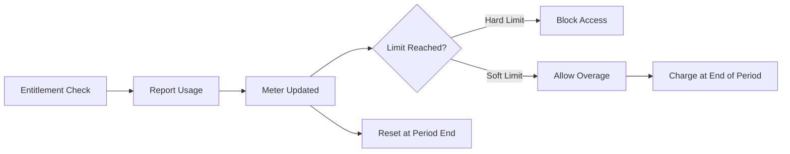

Usage metering lets you track consumption of metered features (defined with `type: "metered"`) and bill customers based on actual usage. Revstack handles meter storage, reset scheduling, and overage calculations automatically.

## How Metering Works

Metered features follow this lifecycle:



<Steps>
  <Step title="Define metered feature">
    Configure the feature with `type: "metered"` and `reset_period`.
  </Step>
  
  <Step title="Check entitlement before usage">
    Verify the customer has capacity for the requested amount.
  </Step>
  
  <Step title="Report usage after consumption">
    Increment the customer's usage meter with the actual amount consumed.
  </Step>
  
  <Step title="Automatic reset">
    Revstack resets meters at the end of each period (daily, weekly, monthly, etc.).
  </Step>
</Steps>

## Defining Metered Features

Configure features with reset periods in your billing config:

```typescript revstack/features.ts
import { defineFeature } from "@revstackhq/core";

export const features = {
  api_calls: defineFeature({
    name: "API Calls",
    type: "metered",
    unit_type: "requests",
  }),

  ai_tokens: defineFeature({
    name: "AI Tokens",
    description: "Combined input + output tokens",
    type: "metered",
    unit_type: "tokens",
  }),

  storage_bytes: defineFeature({
    name: "Storage",
    type: "metered",
    unit_type: "bytes",
  }),
};
```

Then configure limits and reset periods in your plans:

```typescript revstack/plans.ts
import { definePlan } from "@revstackhq/core";
import { features } from "./features";

export const plans = {
  pro: definePlan<typeof features>({
    name: "Pro",
    type: "paid",
    prices: [
      {
        amount: 2900,
        currency: "USD",
        billing_interval: "monthly",
        overage_configuration: {
          api_calls: {
            overage_amount: 10, // $0.10 in cents
            overage_unit: 1000, // per 1,000 calls
          },
          ai_tokens: {
            overage_amount: 15,
            overage_unit: 1000000, // per 1M tokens
          },
        },
      },
    ],
    features: {
      api_calls: {
        value_limit: 100000, // 100K included
        is_hard_limit: false, // Allow overage
        reset_period: "monthly",
      },
      ai_tokens: {
        value_limit: 10000000, // 10M included
        is_hard_limit: false,
        reset_period: "monthly",
      },
      storage_bytes: {
        value_limit: 10737418240, // 10 GB
        is_hard_limit: true, // Block when full
        reset_period: "never", // Doesn't reset
      },
    },
  }),
};
```

### Reset Periods

<ParamField path="reset_period" type="ResetPeriod">
  - **`daily`**: Resets at midnight UTC every day
  - **`weekly`**: Resets at midnight UTC every Sunday
  - **`monthly`**: Resets at midnight UTC on the 1st of each month
  - **`yearly`**: Resets at midnight UTC on January 1st
  - **`never`**: Never resets (useful for storage quotas)
</ParamField>

<Info>
  Revstack handles reset scheduling automatically. You don't need to run cron jobs or background workers.
</Info>

## Reporting Usage

Use the Usage Client to report consumption:

```typescript
import { Revstack } from "@revstackhq/node";

const revstack = new Revstack({ secretKey: process.env.REVSTACK_SECRET_KEY });

// Report API call usage
await revstack.usage.report({
  customerId: "usr_abc123",
  featureId: "api_calls",
  amount: 1,
});

// Report AI token usage
await revstack.usage.report({
  customerId: "usr_abc123",
  featureId: "ai_tokens",
  amount: 5420, // Actual tokens consumed
  idempotencyKey: `req_${requestId}`, // Prevent double-counting
});

// Report storage usage
await revstack.usage.report({
  customerId: "usr_abc123",
  featureId: "storage_bytes",
  amount: 1048576, // 1 MB uploaded
});
```

### Idempotency Keys

Use idempotency keys to prevent double-counting if your request is retried:

```typescript
await revstack.usage.report({
  customerId: userId,
  featureId: "api_calls",
  amount: 1,
  idempotencyKey: `req_${requestId}`, // Same key = idempotent
});
```

<Warning>
  Always use idempotency keys for production workloads. Network failures or retries can lead to duplicate usage reports.
</Warning>

## Querying Usage Meters

Retrieve current usage for a customer:

```typescript
// Get all meters for a customer
const meters = await revstack.usage.getMeters("usr_abc123");
console.log(meters);
// [
//   {
//     featureId: 'api_calls',
//     currentUsage: 45230,
//     limit: 100000,
//     resetAt: '2026-04-01T00:00:00Z',
//     resetPeriod: 'monthly',
//   },
//   {
//     featureId: 'ai_tokens',
//     currentUsage: 8500000,
//     limit: 10000000,
//     resetAt: '2026-04-01T00:00:00Z',
//     resetPeriod: 'monthly',
//   },
// ]

// Get a single meter
const apiCallsMeter = await revstack.usage.getMeter("usr_abc123", "api_calls");
console.log(apiCallsMeter);
// {
//   featureId: 'api_calls',
//   currentUsage: 45230,
//   limit: 100000,
//   remaining: 54770,
//   resetAt: '2026-04-01T00:00:00Z',
//   resetPeriod: 'monthly',
// }
```

## Reverting Usage

If an operation fails after you've already reported usage, revert it:

```typescript
// Optimistic usage pattern
await revstack.usage.report({
  customerId: userId,
  featureId: "ai_tokens",
  amount: 5000,
});

try {
  const result = await openai.chat.completions.create({ /* ... */ });
} catch (error) {
  // Revert usage if the operation failed
  await revstack.usage.revert({
    customerId: userId,
    featureId: "ai_tokens",
    amount: 5000,
    reason: "operation_failed",
  });
  throw error;
}
```

<Info>
  The `reason` field is stored for audit trails. Use descriptive reasons like `"operation_failed"`, `"refund_issued"`, or `"duplicate_request"`.
</Info>

## Hard vs Soft Limits

### Hard Limits (Strict Quotas)

Block access when the limit is reached:

```typescript
features: {
  storage_bytes: {
    value_limit: 10737418240, // 10 GB
    is_hard_limit: true, // No overage allowed
    reset_period: "never",
  },
}
```

**Entitlement check behavior**:

```typescript
const check = await revstack.entitlements.check(userId, "storage_bytes", { amount: 1048576 });

if (check.allowed) {
  await uploadFile(file);
  await revstack.usage.report({ customerId: userId, featureId: "storage_bytes", amount: file.size });
} else {
  // check.reason === 'limit_reached'
  throw new Error("Storage quota exceeded. Please upgrade your plan.");
}
```

### Soft Limits (Overage Allowed)

Allow usage beyond the included limit with additional charges:

```typescript
features: {
  api_calls: {
    value_limit: 100000,
    is_hard_limit: false, // Allow overage
    reset_period: "monthly",
  },
}

// Configure overage pricing in the plan
prices: [
  {
    amount: 2900,
    currency: "USD",
    billing_interval: "monthly",
    overage_configuration: {
      api_calls: {
        overage_amount: 10, // $0.10 per 1,000 calls
        overage_unit: 1000,
      },
    },
  },
]
```

**Entitlement check behavior**:

```typescript
const check = await revstack.entitlements.check(userId, "api_calls", { amount: 1 });

if (check.allowed) {
  if (check.reason === "overage_allowed") {
    // User is beyond their included limit - will be charged extra
    console.log(`Overage cost estimate: $${check.cost_estimate / 100}`);
  }

  await processApiCall();
  await revstack.usage.report({ customerId: userId, featureId: "api_calls", amount: 1 });
}
```

<Warning>
  **Important**: The Entitlement Engine determines **if** overage is allowed (`is_hard_limit: false`). The `overage_configuration` in your plan's `prices` determines **how much** to charge.
</Warning>

## Common Patterns

### Optimistic Usage Reporting

For low-latency operations, report usage immediately after the entitlement check:

```typescript
// 1. Check entitlement (fast)
const check = await revstack.entitlements.check(userId, "ai_tokens", { amount: 5000 });
if (!check.allowed) throw new Error("Token limit exceeded");

// 2. Report estimated usage immediately (don't wait)
await revstack.usage.report({
  customerId: userId,
  featureId: "ai_tokens",
  amount: 5000,
});

// 3. Call external API (slow)
const result = await openai.chat.completions.create({ max_tokens: 5000, /* ... */ });

// 4. Adjust if actual usage differs (optional)
const actualUsage = result.usage.total_tokens;
if (actualUsage !== 5000) {
  await revstack.usage.revert({
    customerId: userId,
    featureId: "ai_tokens",
    amount: 5000,
    reason: "adjustment",
  });
  await revstack.usage.report({
    customerId: userId,
    featureId: "ai_tokens",
    amount: actualUsage,
  });
}
```

### Batch Usage Reporting

For high-throughput workloads, batch reports to reduce API calls:

```typescript
// Accumulate usage in memory
const usageBuffer: Map<string, number> = new Map();

function trackUsage(customerId: string, amount: number) {
  const current = usageBuffer.get(customerId) || 0;
  usageBuffer.set(customerId, current + amount);
}

// Flush periodically (e.g., every 10 seconds)
setInterval(async () => {
  const reports = Array.from(usageBuffer.entries()).map(([customerId, amount]) => ({
    customerId,
    featureId: "api_calls",
    amount,
  }));

  await Promise.all(reports.map((r) => revstack.usage.report(r)));
  usageBuffer.clear();
}, 10000);
```

<Warning>
  **Tradeoff**: Batching improves performance but delays usage updates. Entitlement checks may be stale if the meter hasn't been flushed yet.
</Warning>

### Displaying Usage to Users

Show current usage in your dashboard:

```tsx
import { useState, useEffect } from "react";
import { Revstack } from "@revstackhq/node";

function UsageDashboard({ userId }: { userId: string }) {
  const [meters, setMeters] = useState<any[]>([]);

  useEffect(() => {
    async function fetchUsage() {
      const revstack = new Revstack({ secretKey: process.env.REVSTACK_SECRET_KEY });
      const data = await revstack.usage.getMeters(userId);
      setMeters(data);
    }
    fetchUsage();
  }, [userId]);

  return (
    <div>
      {meters.map((meter) => {
        const percentUsed = (meter.currentUsage / meter.limit) * 100;
        const resetDate = new Date(meter.resetAt).toLocaleDateString();

        return (
          <div key={meter.featureId}>
            <h3>{meter.featureId}</h3>
            <ProgressBar value={percentUsed} />
            <p>
              {meter.currentUsage.toLocaleString()} / {meter.limit.toLocaleString()}
              {" "}({percentUsed.toFixed(1)}% used)
            </p>
            <p>Resets on {resetDate}</p>
          </div>
        );
      })}
    </div>
  );
}
```

### Proactive Overage Notifications

Warn users before they hit overage:

```typescript
const check = await revstack.entitlements.check(userId, "api_calls", { amount: 1 });

if (check.remaining !== undefined && check.remaining < 1000) {
  // User has less than 1,000 calls remaining
  await sendEmail({
    to: user.email,
    subject: "API quota running low",
    body: `You have ${check.remaining} API calls remaining this month.`,
  });
}
```

## Billing Workflow

Revstack handles overage billing automatically:

1. **During the period**: Usage is tracked and accumulated
2. **At period end**: Revstack calculates overage charges based on `overage_configuration`
3. **Invoice generation**: Overage is added to the next invoice
4. **Meter reset**: Usage resets to 0 for the new period

<Info>
  Overage charges are invoiced at the end of the billing period, not in real-time. This matches how providers like AWS and Stripe handle usage-based billing.
</Info>

## Next Steps

<CardGroup cols={2}>
  <Card title="Subscriptions" icon="credit-card" href="/concepts/subscriptions">
    Learn how subscriptions handle recurring billing
  </Card>
  <Card title="Providers" icon="plug" href="/concepts/providers">
    Understand payment provider integrations
  </Card>
</CardGroup>
